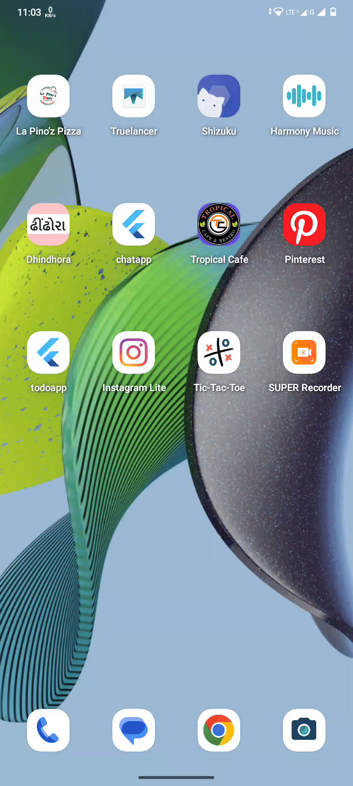

# Tic-Tac-Toe

**A clean and interactive Tic Tac Toe game built with Flutter. Challenge your friends to a classic
2-player game with a modern UI and smooth animations.**

_🚀 Features_

* 2-player local multiplayer (Player X vs Player O)
* Timer-based turn system (30 seconds per turn)
* Animated winning cells
* Dynamic game restart functionality
* Smooth UI transitions with animations
* Responsive and modern design

## Demo

